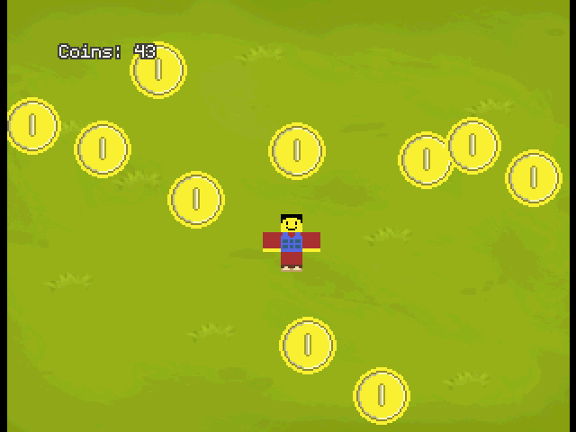

# N64 2D Coin Game Example



https://github.com/user-attachments/assets/a48eeff5-7574-4eb0-89c7-70c0c3e915fb

An N64 program that showcases how one can write and build a simple 2D coin collecting game using Libdragon.

## How to Build N64 2D Coin Game Example
This tutorial assumes you have your N64 Toolchain set up including GCC for MIPS64.

Run make to build this project:

```bash
libdragon make
```

---

## Licenses

Everything in the src folder is licensed under The Unlicense.

In the assets folder the following assets are in the public domain:
- [player.png - Aftersol](./assets/player.png)
- [coin.png - Aftersol](./assets/coin.png)
- [hassekf - Tower Defense - Grass Background](https://opengameart.org/content/tower-defense-grass-background)
- [Luke.RUSTLTD - 8-bit Coin Sound](https://opengameart.org/content/10-8bit-coin-sounds)
